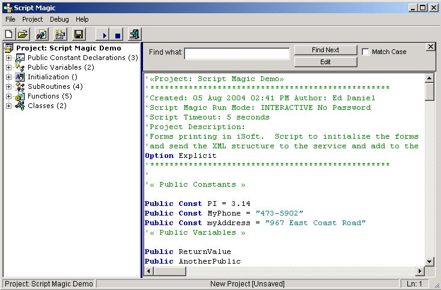



## A ScriptMagic DLL

### Description

UPDATED 8/16 A turnkey ActiveX DLL that allows you to REALLY embed VBA style scripting into your application. With built-in code editor and events. Must see to appreciate. You can use early OR late binding and still process realtime events. A lot of code came from this site for some of the support objects. PSC has been such a great help to me for many years, but I've never submitted anything before.

VBScript is a powerful tool, but why embed it into your application UNLESS there is a way to really control it AFTER you deploy your application. With this, you could either let users create their own code OR create customer-specific validation/processing/complete subsystems

POST deployment. Enjoy and please give me feedback (positive or negative) all welcomed. Open the Group Project in the TestHarness folder and run.
 
### More Info
 

             |
---                |---
**Submitted On**   |2004-08-16 03:17:10
**By**             |[Ed Daniel](https://github.com/Planet-Source-Code/PSCIndex/blob/master/ByAuthor/ed-daniel.md)
**Level**          |Advanced
**User Rating**    |5.0 (50 globes from 10 users)
**Compatibility**  |VB 6\.0, VB Script
**Category**       |[OLE/ COM/ DCOM/ Active\-X](https://github.com/Planet-Source-Code/PSCIndex/blob/master/ByCategory/ole-com-dcom-active-x__1-29.md)
**World**          |[Visual Basic](https://github.com/Planet-Source-Code/PSCIndex/blob/master/ByWorld/visual-basic.md)
**Archive File**   |[A\_ScriptMa1782528162004\.zip](https://github.com/Planet-Source-Code/ed-daniel-a-scriptmagic-dll__1-55570/archive/master.zip)

